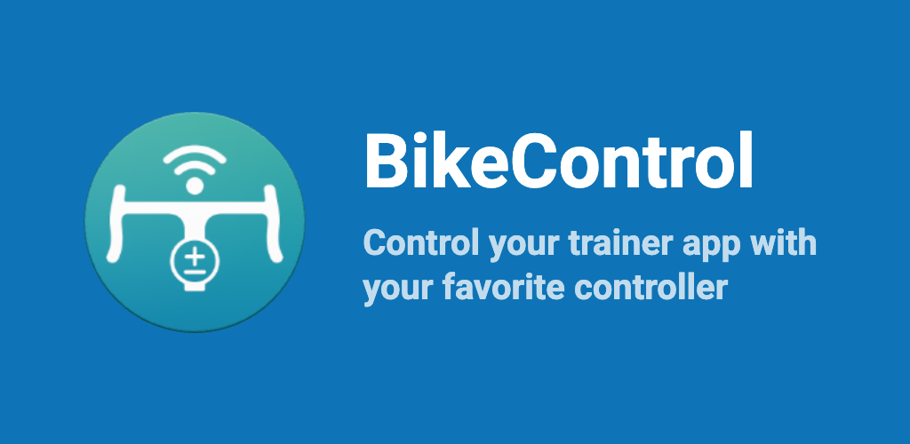

# BikeControl (formerly SwiftControl)

## Description

With BikeControl you can **control your favorite trainer app** using your Zwift Click, Zwift Ride, Zwift Play, or other similar devices. Here's what you can do with it, depending on your configuration:
- Virtual Gear shifting
- Steering/turning
- adjust workout intensity
- control music on your device
- more? If you can do it via keyboard, mouse, or touch, you can do it with BikeControl

https://github.com/user-attachments/assets/1f81b674-1628-4763-ad66-5f3ed7a3f159

## Downloads
Best follow our landing page and the "Get Started" button: [bikecontrol.app](https://bikecontrol.app/) to understand on which platform you want to run BikeControl.

## Supported Apps
- MyWhoosh
- Zwift
- TrainingPeaks Virtual / indieVelo
- Biketerra.com
- Rouvy
- any other!
  - You can add custom mapping and adjust touch points or keyboard shortcuts to your liking

## Supported Devices
- Zwift Click
- Zwift Click v2 (mostly, see issue #68)
- Zwift Ride
- Zwift Play
- Shimano Di2
  - Configure your levers to use D-Fly channels with Shimano E-Tube app
- Wahoo Kickr Bike Shift
- Wahoo Kickr Bike Pro
- CYCPLUS BC2 Virtual Shifter
- Elite Sterzo Smart (for steering support)
- Elite Square Smart Frame (beta)
- Gamepads (beta)
- Cheap Bluetooth buttons such as [these](https://www.amazon.com/s?k=bluetooth+remote) (beta)
  - BLE HID devices and classic Bluetooth HID devices are supported
  - works on Android
  - on iOS and macOS requires BikeControl to act as media player

Support for other devices can be added; check the issues tab here on GitHub. 

## Supported Platforms

Follow the "Get Started" button over at [bikecontrol.app](https://bikecontrol.app) to understand on which platform you want to run BikeControl.
You can even try it out in your [Browser](https://jonasbark.github.io/swiftcontrol/), if it supports Bluetooth connections. No controlling possible, though.

## Troubleshooting
Check the troubleshooting guide [here](TROUBLESHOOTING.md).

## How does it work?
The app connects to your Controller devices (such as Zwift ones) automatically. It does not connect to your trainer itself.

- **Android**: BikeControl uses the AccessibilityService API to simulate touch gestures on specific parts of your screen to trigger actions in training apps. The service monitors which training app window is currently active to ensure gestures are sent to the correct app.
- **iOS**: use BikeControl as a "remote control" for other devices, such as an iPad. Example scenario:
  - your phone (Android/iOS) runs BikeControl and connects to your Controller devices
  - your iPad or other tablet runs e.g. MyWhoosh (does not need to have BikeControl installed)
  - If you want to use MyWhoosh, you can use the Link method to connect to MyWhoosh directly
  - For other trainer apps, you need to pair BikeControl to your iPad / tablet via Bluetooth, and your phone will send the button presses to your iPad / tablet
- **macOS** / **Windows** A keyboard or mouse click is used to trigger the action. 
  - There are predefined Keymaps for MyWhoosh, indieVelo / Training Peaks, and others
  - You can also create your own Keymaps for any other app
  - You can also use the mouse to click on a certain part of the screen, or use keyboard shortcuts

## Alternatives
- [qdomyos-zwift](https://www.qzfitness.com/) directly controls the trainer (as opposed to controlling the trainer app). This can be useful if your trainer app does not support virtual shifting.

## Donate
Please consider donating to support the development of this app :)

- [via PayPal](https://paypal.me/boni)
- [via Credit Card, Google Pay, Apple Pay, etc (USD)](https://donate.stripe.com/8x24gzc5c4ZE3VJdt36J201)
- [via Credit Card, Google Pay, Apple Pay, etc (EUR)](https://donate.stripe.com/9B6aEX0muajY8bZ1Kl6J200)
